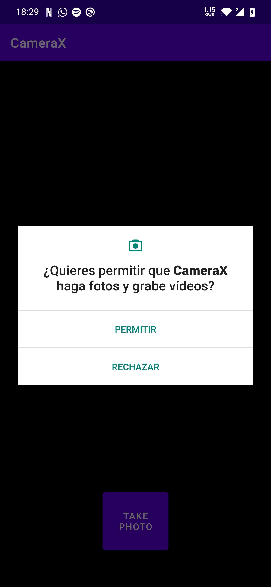

# Uso de CameraX

### Ejemplo sencillo del uso de Camera X

## Imagenes del proyecto IntercambioColores
  

## Codigo

```kotlin
//Ejecutar camara
    private fun startCamera() {
        val cameraProviderFuture = ProcessCameraProvider.getInstance(this)
        val cameraSelector = CameraSelector.Builder().requireLensFacing(CameraSelector.LENS_FACING_BACK).build()

        cameraProviderFuture.addListener(Runnable {
            val cameraProvider: ProcessCameraProvider = cameraProviderFuture.get()

            preview = Preview.Builder()
                    .build()
                    .also { it.setSurfaceProvider(viewFinder.createSurfaceProvider()) }

            imageCapture = ImageCapture.Builder()
                    .setCaptureMode(ImageCapture.CAPTURE_MODE_MINIMIZE_LATENCY)
                    .build()

            imageAnalyzer = ImageAnalysis.Builder()
                    .build()
                    .also {
                        it.setAnalyzer(cameraExecutor, LuminosityAnalyzer { luma ->
                            Log.d(TAG, "Average luminosity: $luma")
                        })
                    }
            try {
                cameraProvider.unbindAll()
                camera = cameraProvider.bindToLifecycle(this, cameraSelector, preview,imageCapture,imageAnalyzer)
                preview?.setSurfaceProvider(viewFinder.createSurfaceProvider())
            } catch(exc: Exception) {
                Log.e(TAG, "Use case binding failed", exc)
            }
        }, ContextCompat.getMainExecutor(this))
    }
```

```kotlin
//Capturar foto
    private fun takePhoto() {
        val imageCapture = imageCapture ?: return
        val photoFile = File(outputDirectory, SimpleDateFormat(FILENAME_FORMAT, Locale.US).format(System.currentTimeMillis()) + ".jpg")
        val outputOptions = ImageCapture.OutputFileOptions.Builder(photoFile).build()

        imageCapture.takePicture(outputOptions, ContextCompat.getMainExecutor(this), object : ImageCapture.OnImageSavedCallback {
            override fun onError(exc: ImageCaptureException) {
                Log.e(TAG, "Photo capture failed: ${exc.message}", exc)
            }

            override fun onImageSaved(output: ImageCapture.OutputFileResults) {
                val savedUri = Uri.fromFile(photoFile)
                val msg = "Photo capture succeeded: $savedUri"
                Toast.makeText(baseContext, msg, Toast.LENGTH_SHORT).show()
                Log.d(TAG, msg)
            }
        })
    }
```

