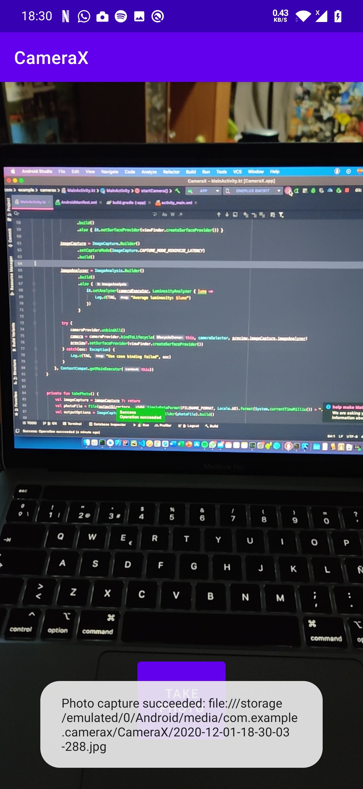

# Proyectos de ejemplos de diferentes componentes de Android con kotlin

## CAMERA X
  

## JetPack
Ejemplos sencillos con Navigation, Room, ViewModel y componentes de la libreria de JetPack

## Encrypted SharedPreferences and Files

